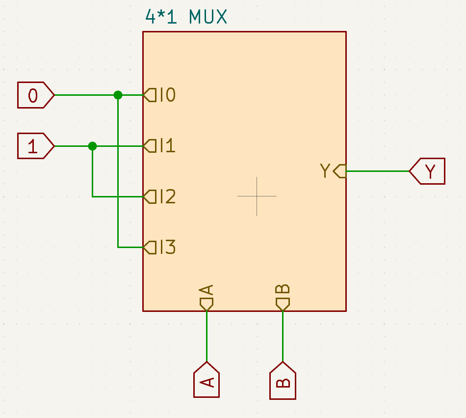

# 🔍 What is a LUT (Look-Up Table)?

A **Look-Up Table (LUT)** is a fundamental component in digital electronics. It functions as a versatile combinational circuit by storing the output values for every possible input combination, effectively replicating the behavior of a dedicated logic circuit.

Instead of manually designing a circuit using logic gates like AND, OR, or XOR based on a truth table, a LUT simplifies the process by directly storing the truth table itself. When an input is provided, the LUT retrieves and outputs the corresponding pre-computed value.

This approach eliminates the need for complex circuit design and expression derivation, making LUTs especially valuable in programmable logic devices such as FPGAs.

Every FPGA logic block contains LUTs (usually 4-input in iCE40) paired with flip-flops, making them flexible for any logic function.

# How to build one?

A LUT can be viewed as a multiplexer where the selector lines represent the input variables of a function, and the data inputs correspond to the function’s predefined output values. The multiplexer’s output then serves as the final output of the function.

## Example: 🔄 XOR Function Using a 4×1 Multiplexer

The XOR function can be implemented using a 4×1 multiplexer by assigning the correct logic levels to the data inputs based on the truth table.

<table>
  <tr>
    <td>

### 🧮 XOR Truth Table

| A | B | Select (AB) | Output |
|---|---|--------------|--------|            
| 0 | 0 | 00           |   0    |
| 0 | 1 | 01           |   1    |
| 1 | 0 | 10           |   1    |
| 1 | 1 | 11           |   0    |

### 🧩 MUX Configuration

To replicate this behavior using a 4×1 MUX:
- **Select lines**: A and B  
- **Data inputs**:
  - I₀ = 0  
  - I₁ = 1  
  - I₂ = 1  
  - I₃ = 0  

    </td>
    <td style="padding-left: 20px;">
      
    </td>
  </tr>
</table>

A detailed simulation of the XOR function using a 4×1 multiplexer can be accessed via [XOR_MUX](https://circuitverse.org/users/335760/projects/xor_mux-25da6eb6-d3a2-4ed3-93e5-1d5b224fb42e).

This demonstrates how a LUT can be realized using multiplexers, where the select lines are the input variables and the data inputs represent the function's output values.

# How to build a LUT using verilog 

**Verilog code to build a 2-input LUT**
```verilog
module lut_example (
    input  [1:0] addr,       // 2-bit address input
    output reg [3:0] data    // 4-bit output (can be adjusted as needed)
);

always @(*) begin
    case (addr)
        2'b00: data = 4'h1;
        2'b01: data = 4'h3;
        2'b10: data = 4'h5;
        2'b11: data = 4'hF;
        default: data = 4'h0;
    endcase
end

endmodule

```
**Code explanation**
```verilog
module lut_example (
  input[1:0]addr,
  output reg [3:0] data
);
```
module lut_example : Declares a module named lut_example.<br>
input[1:0] addr : A 2-bit input signal, which acts like an adress or selector (values from 0 to 3)<br>
output reg [3:0] data : an 4-bit output that holds the value corresponding to the input address

```verilog
always @(*) begin
```
This is a combinational always block. it means the logic inside will update whenever any input changes, no clock required

```verilog
    case (addr)
        2'b00: data = 4'h1;
        2'b01: data = 4'h3;
        2'b10: data = 4'h5;
        2'b11: data = 4'hF;
        default: data = 4'h0;
    endcase
```
This is a case statement that checks the value of addr.<br>
For each possible 3-bit input (from 000 to 111), it assigns a specific 8-bit hexadecimal value to data.<br>
default ensures a fallback value (8'h00) if addr somehow goes out of range (which shouldn't happen with 3 bits).

```verilog
endmodule
```
Marks the end of the module.

# Verilog Code: 2-input LUT for XOR
```verilog
module xor_lut (
    input  [1:0] addr,     // Combined inputs A and B
    output reg data        // XOR output
);

always @(*) begin
    case (addr)
        2'b00: data = 1'b0;  // A=0, B=0 → 0
        2'b01: data = 1'b1;  // A=0, B=1 → 1
        2'b10: data = 1'b1;  // A=1, B=0 → 1
        2'b11: data = 1'b0;  // A=1, B=1 → 0
        default: data = 1'b0;
    endcase
end

endmodule
```

---

## ✅ Summary

- LUTs simplify logic design by storing output values directly.
- They are often implemented using multiplexers in hardware.
- The XOR function is a classic example of how a LUT can replicate logic using a 4×1 MUX.
